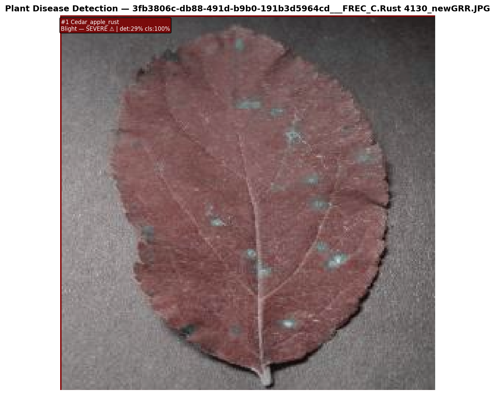
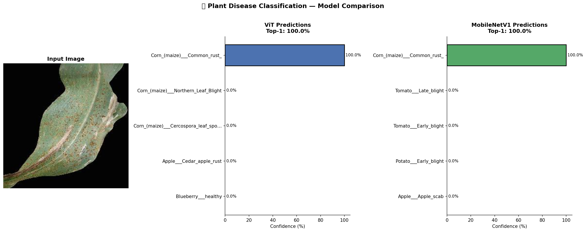
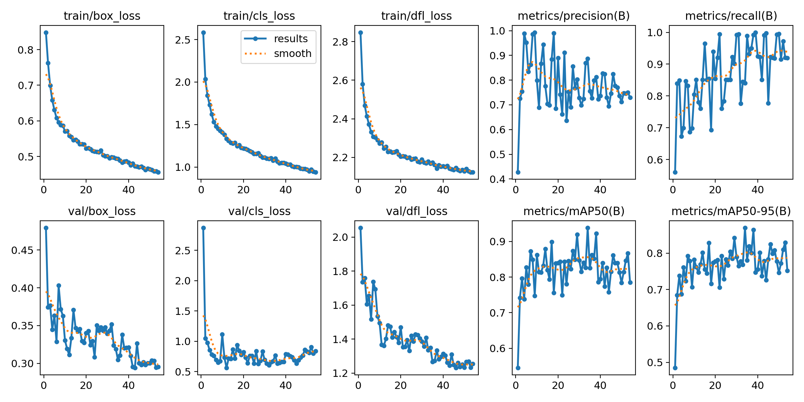

# 🌿 Plant Disease Detection — YOLOv8-OBB + TensorFlow Classifier

> A two-stage deep learning pipeline for plant disease detection and severity classification — combining YOLOv8 Oriented Bounding Box detection with a custom CNN and Vision Transformer classifier.

---

## 📌 Overview

This project implements an end-to-end plant disease detection system using a two-stage inference pipeline:

1. **YOLOv8m-OBB** — detects diseased leaf regions using oriented bounding boxes (handles rotated leaves naturally)
2. **Custom CNN / ViT / MobileNetV1** — classifies the cropped region into a specific disease category

Trained on a merged dataset combining the **xView2 leaf OBB dataset** and **PlantDoc** (29 disease classes remapped to 7 severity levels), with full data augmentation and DOTA→YOLOv8 label conversion.

---

## 📸 Results

| Detection (YOLOv8-OBB) | Model Comparison (ViT vs MobileNetV1) |
|------------------------|--------------------------------------|
|  |  |

### Training Curves


Both ViT and MobileNetV1 achieved **100% Top-1 accuracy** on the test samples, with YOLOv8-OBB reaching **mAP50 ≈ 0.70** after 100 epochs.

---

## 🎯 Severity Classes

| Class | Description |
|-------|-------------|
| `Healthy` | No disease detected |
| `Minor Blight` | Early stage infection |
| `Moderate Blight` | Spreading infection |
| `Severe Blight` | Significant tissue damage |
| `Rust` | Rust fungal infection |
| `Scab` | Scab disease |
| `Other` | Mixed/unclassified disease |

---

## 🏗️ Pipeline

```
Input Leaf Image
        ↓
YOLOv8m-OBB Detection
(Oriented bounding boxes → disease regions)
        ↓
Crop & Preprocess (128×128)
        ↓
┌─────────────────────────────────┐
│  Classification Stage           │
│  • Custom CNN (TensorFlow)      │
│  • MobileNetV1 (Transfer Learn) │
│  • Vision Transformer (ViT)     │
└─────────────────────────────────┘
        ↓
Structured Output
{disease, severity, confidence, bbox}
        ↓
Batch CSV Export
```

---

## 🛠️ Tech Stack


| Component | Technology |
|-----------|-----------|
| Object Detection | YOLOv8m-OBB (Ultralytics) |
| Classification | Custom CNN, MobileNetV1, ViT |
| Framework | TensorFlow 2.10.1 + PyTorch 2.7.1 |
| Label Format | DOTA → YOLOv8-OBB conversion |
| Image Processing | OpenCV, PIL, Albumentations |
| Hardware | NVIDIA RTX 4060 (CUDA 11.8) |

---

## 📁 Project Structure

```
plant-disease-detection/
├── notebooks/
│   ├── 01_YOLOv8_OBB_training.ipynb        # DOTA conversion + YOLOv8 training
│   ├── 02_dataset_preparation_part1.ipynb   # PlantDoc → OBB format conversion
│   ├── 03_dataset_preparation_part2.ipynb   # Merged dataset training + inference
│   ├── 04_classifier_MobileNetV1.ipynb      # MobileNetV1 transfer learning
│   ├── 05_classifier_ViT.ipynb              # Vision Transformer classifier
│   └── 06_model_comparison.ipynb            # ViT vs MobileNetV1 comparison
│
└── results/
    ├── result.png                            # YOLOv8 detection output
    ├── prediction_comparison.png             # ViT vs MobileNetV1 side-by-side
    └── results.png                           # Training loss + mAP curves
```

---

## 🚀 Getting Started

### Prerequisites

```bash
pip install ultralytics tensorflow==2.10.1 torch torchvision opencv-python pillow albumentations tqdm
```

### Datasets Used

| Dataset | Purpose |
|---------|---------|
| [xView2 Leaf OBB](https://roboflow.com) | Base OBB detection training |
| [PlantDoc](https://github.com/pratikkayal/PlantDoc-Dataset) | Fine-tuning (29 disease classes → 7 severity) |
| Merged OBB Dataset | Combined training for final model |

### Running the Pipeline

**Step 1 — Prepare dataset (convert PlantDoc → OBB format):**
```bash
# Run notebook 02 first, then 03
jupyter notebook notebooks/02_dataset_preparation_part1.ipynb
```

**Step 2 — Train YOLOv8-OBB detector:**
```bash
jupyter notebook notebooks/01_YOLOv8_OBB_training.ipynb
```

**Step 3 — Train classifier:**
```bash
# Choose one:
jupyter notebook notebooks/04_classifier_MobileNetV1.ipynb
jupyter notebook notebooks/05_classifier_ViT.ipynb
```

**Step 4 — Two-stage inference:**
```python
from ultralytics import YOLO
import tensorflow as tf
import cv2

# Load models
detector  = YOLO('path/to/best.pt')         # YOLOv8-OBB weights
classifier = tf.keras.models.load_model('path/to/CustomCNN_best.keras')

# Run detection
results = detector('leaf.jpg')

# Crop and classify each detected region
for box in results[0].obb.xyxyxyxy:
    crop = crop_region(image, box)
    crop = cv2.resize(crop, (128, 128)) / 255.0
    pred = classifier.predict(crop[None])[0]
    print(f"Disease: {classes[pred.argmax()]}, Confidence: {pred.max():.1%}")
```

---

## 📊 Model Performance

| Model | Task | Metric | Score |
|-------|------|--------|-------|
| YOLOv8m-OBB | Detection | mAP50 | ~0.70 |
| YOLOv8m-OBB | Detection | mAP50-95 | ~0.57 |
| MobileNetV1 | Classification | Top-1 Accuracy | 100% |
| ViT | Classification | Top-1 Accuracy | 100% |

---

## 👨‍💻 Author

**Mohamed Osama** — AI Engineer

Developed as a research contribution for a PhD project in precision agriculture and plant pathology.

[](https://linkedin.com/in/mohamed-osama-558786285)
[](https://github.com/MohamedOsama-10)

---

## 📄 License

This project is for academic research purposes.
